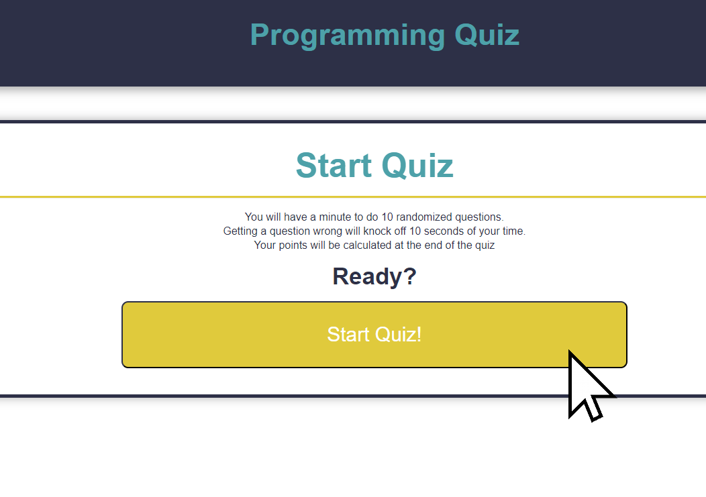
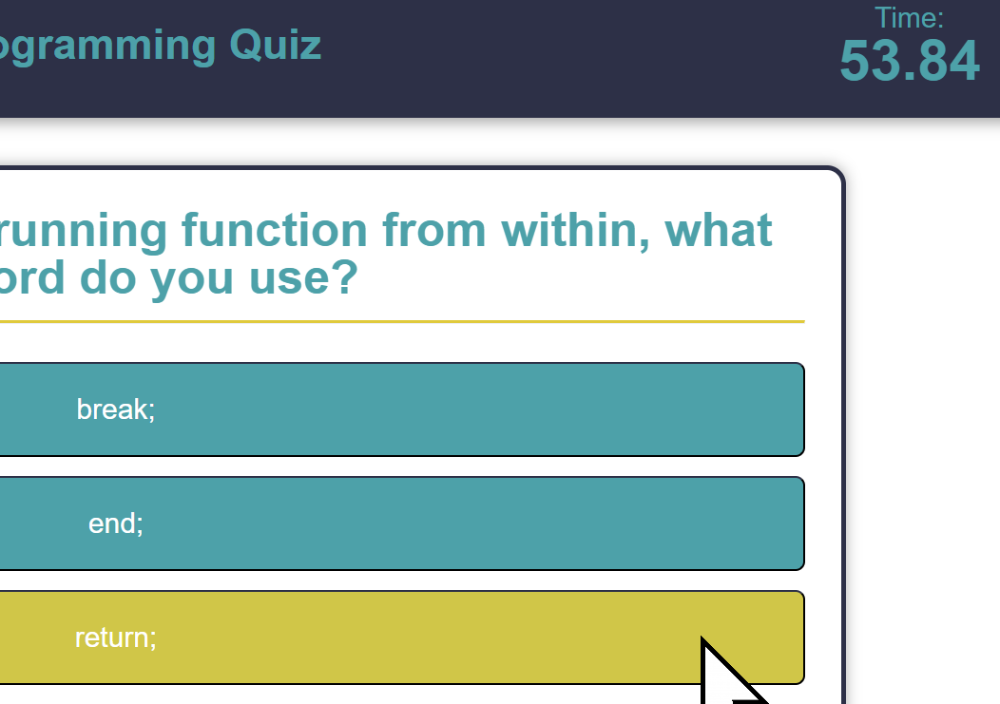
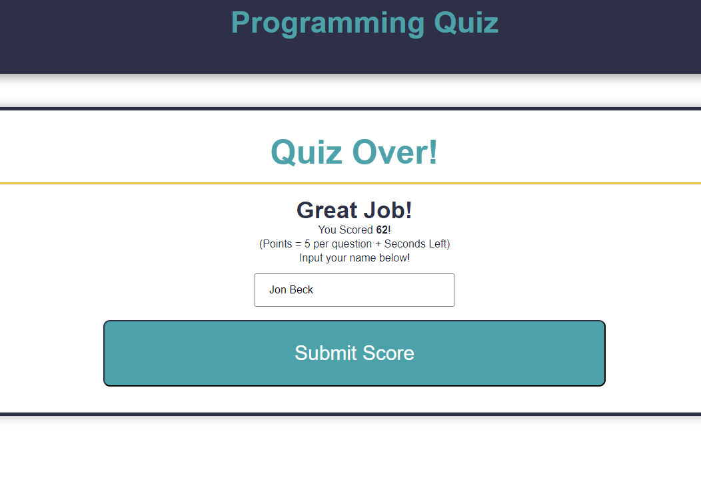
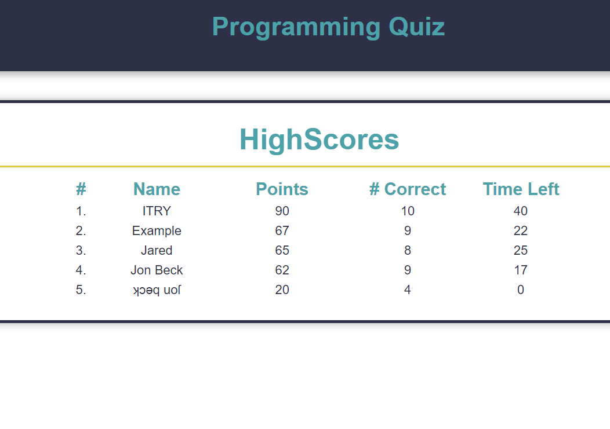

# Code Quiz/Programming Quiz

## Outline

This website will prompt you with 10 programming questions in a 60 second timed quiz format. Answering questions correctly will gain you points and answering them wrong will loose you 10 seconds. When quiz is finished, you can save your highscore to localdata with a name. Your highscores can be viewed on a leaderboard that can be clicked to at any time.

## Design Liberties

I had a lot of fun with this specific challenge. Because of this, I added or changed some feature that were not in the original outline.

One of the biggest you may notice is that the quiz has a total of 10 question instead of five. Furthermore, these questions are taken from a list of 20 questions randomly and can have more or less than 4 possible answers.

Another change is the way the score is calculated. In the mock-up, the Score was calculated based on time left on the clock, however in my project, it is based on: (questions correct * 5) + Time left in seconds.

Lastly, the High Score Does not just store the score, but also the amount of questions correct and the time left.

## Code Notes

Firstly, there were some edge cases I had coded. One being that there is an alert when going to the high score page from the quiz or end page. This is bacause doing that will stop the quiz and highscore processes. Another edge case is that you cannot submit score with an emptybox to prevent blank names.

A big thing to note is that all the questions, answers, and options are stored in a seperate javascript file. This is because I did not want the questions to increase the size of my regular script file. The Questions are stored in an array with each question being an object with its strings as properties. The best thing about coding it this way is that I can add questions with relative ease!

Lastly, the highscore stats are stored in an 2D array. This is to make it easier to get and store specific player stats.